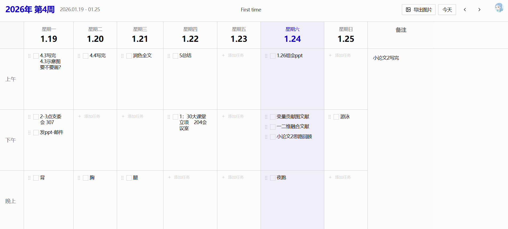

# 简周 (SimpleWeek) v2.0

一个极简、高效、高度可定制的周计划管理工具，帮助您掌控每周的工作与生活。

**在线访问**: [https://simple-week.vercel.app](https://simple-week.vercel.app)




## 核心功能

- **📅 周视图**: 清晰展示一周七天，每天分为上午、下午、晚上三个时间块，支持响应式布局。
- **✅ 任务管理**: 轻松添加、编辑、删除任务，点击圆点切换完成状态（删除线效果）。
- **🔄 拖拽排序**: 在不同时间块之间拖拽移动任务，灵活安排日程。
- **📝 备注栏**: 每周独立的备注区域，全区域可编辑，记录灵感和想法。
- **📖 周总结**: 集成周总结功能，每日记录 + 周关键词 + 周总结感悟，支持导出 Word 文档。
- **🎨 自定义内容**: 在周视图顶部添加文字或图片，打造个性化界面。
- **🖼️ 图片导出**: 一键将当前周计划导出为图片，方便分享和打印。
- **🚀 快速导航**: 通过年度周选择器，快速跳转到任意一周。
- **🔐 用户认证**: 基于 Clerk 的安全用户认证，支持多用户数据隔离。
- **☁️ 云端同步**: 所有数据实时保存在云端，多设备无缝同步。

## 更新日志

### v2.0 (2025-02-19)

**新增：周总结功能**

- **周计划/周总结切换**: 桌面端 Header 新增切换按钮，一键在周计划和周总结视图之间切换。
- **每日记录**: 周一到周日，每天独立的文本框，自动撑开高度，自由记录每天的事情。
- **周关键词**: 可输入本周关键词（如重要事件），体现在导出文件名中。
- **周总结感悟**: 底部大文本框，用于撰写一周的总结和反思。
- **导出 Word 文档**: 一键导出为 `.docx` 格式，文件名格式为 `2026.2.9-2026.2.15第7周_关键词.docx`。
- **Tab 键缩进**: 在所有文本框中按 Tab 键可插入两个全角空格，实现中文段首缩进。
- **云端自动保存**: 所有周总结数据通过 API 实时保存到云端数据库。
- **周导航联动**: 左右箭头和「今天」按钮在周总结视图中同样有效，可切换不同周的总结。

### v1.5 (2025-02-18)

**交互优化**

- **任务输入支持多行**: 添加和编辑任务时，支持 Shift+Enter 换行输入多行文本。
- **移除拖动图标**: 去掉了任务左侧的六点拖动手柄图标（节省空间），改为整个任务条目可直接拖动排序。
- **删除线替代勾选框**: 移除了 checkbox 勾选框，改为点击圆点指示器切换完成状态（显示删除线），单击任务文字进入编辑模式。
- **备注栏全区域可编辑**: 修复了备注栏右侧空白区域无法点击编辑的问题，现在整个备注区域均可直接点击输入。
- **导出图片名称优化**: 导出图片文件名改为 `2026年 第7周2.9-2.15.png` 格式。

### v1.0

- 初始版本发布，包含周视图、任务管理、拖拽排序、备注栏、自定义内容、图片导出、快速导航、用户认证、云端同步等核心功能。

## 技术栈

- **前端**: React 19, TypeScript, Tailwind CSS 4, Vite
- **后端**: Express, tRPC
- **数据库**: PostgreSQL (Neon)
- **认证**: Clerk
- **存储**: Supabase Storage
- **文档导出**: docx.js
- **部署**: Vercel

## 部署指南

### 1. 准备工作

确保您已经注册以下服务的账号：
- [GitHub](https://github.com)
- [Vercel](https://vercel.com) (使用 GitHub 登录)
- [Neon](https://neon.tech) (免费 PostgreSQL 数据库)
- [Clerk](https://clerk.com) (用户认证服务)
- [Supabase](https://supabase.com) (图片存储)

### 2. 配置服务

1. **Neon**: 创建新项目，复制 Connection string。
2. **Clerk**: 创建新应用，复制 Publishable key 和 Secret key。
3. **Supabase**: 创建新项目，创建名为 `images` 的**公开**存储桶，并复制 Project URL 和 service_role key。

### 3. 部署到 Vercel

1. Fork 或导入此仓库到您的 GitHub。
2. 在 Vercel 中创建新项目，选择您的 GitHub 仓库。
3. 在 Environment Variables 中添加以下变量：

| 变量名 | 值 |
|---|---|
| `DATABASE_URL` | Neon 连接字符串 |
| `CLERK_SECRET_KEY` | Clerk Secret key |
| `VITE_CLERK_PUBLISHABLE_KEY` | Clerk Publishable key |
| `SUPABASE_URL` | Supabase Project URL |
| `SUPABASE_SERVICE_ROLE_KEY` | Supabase service_role key |

4. 点击 Deploy。

### 4. 初始化数据库

部署完成后，需要初始化数据库表：

```bash
# 克隆仓库到本地
git clone https://github.com/YOUR_USERNAME/simple-week.git
cd simple-week

# 安装依赖
pnpm install

# 设置环境变量（创建 .env 文件）
cp .env.example .env
# 编辑 .env 文件，填入您的配置

# 推送数据库 schema
pnpm db:push
```

## 本地开发

```bash
# 安装依赖
pnpm install

# 创建 .env 文件并填入环境变量
cp .env.example .env

# 推送数据库 schema
pnpm db:push

# 启动开发服务器
pnpm dev
```

访问 http://localhost:5173

## 许可证

MIT
